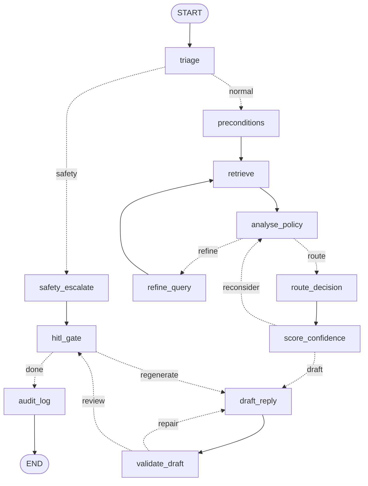

# Support Ticket Triage & Resolution Agent

A LangGraph agent that reads a bank support ticket, retrieves the policy clauses that govern it,
decides whether to auto-resolve, escalate, refuse or ask for more information, drafts a reply,
and routes the draft to a human reviewer. Nothing is sent to a customer.

Built on a fictional US retail bank (Northgate): 150 synthetic tickets, a 59-clause markdown
knowledge base, and a 107-ticket golden evaluation set.

## Setup and running

See **[`docs/setup_and_run.md`](docs/setup_and_run.md)**. It covers installation, the offline
path that needs no API key, building the index, running the queue, the evaluation commands and
the review app, in order.

## The graph



### Nodes

| Node | What it does |
| --- | --- |
| `triage` | Deterministic safety patterns first, then one model call for sentiment, intent and entities. The model can add flags, never remove them. |
| `preconditions` | Computes policy eligibility from the structured record. `met` is tri-state: `None` means not determinable, which drives ASK_MORE_INFO. |
| `retrieve` | Hybrid retrieval: dense (Chroma + bge-small) and BM25, fused by Reciprocal Rank Fusion. Guaranteed clauses are injected on top of `k`. |
| `refine_query` | Rebuilds the query when the retrieved clauses did not settle the question. |
| `analyse_policy` | Separates clauses that decide the question from those that constrain wording. Drops any clause ID the model names that was not retrieved. |
| `route_decision` | Reconciles two independent proposals, one from the rule engine and one from the model. Safety flags and unverified policy resolve to ESCALATE before the model is consulted. |
| `score_confidence` | Five weighted signals, compared against the confidence floor for the chosen route. |
| `draft_reply` | Route-specific drafting. The route is an input, so the draft is never the evidence for the route. |
| `validate_draft` | Checks citations against what was retrieved and scans for prohibited content. Separates hallucinated citations from uncitable ones. |
| `safety_escalate` | The bypass. Returns an empty context and a fixed reply with no model call, so a crisis disclosure cannot be drafted alongside fee clauses. Routes to ESCALATE, never REFUSE. |
| `hitl_gate` | Every path passes through here. `auto` and `simulate` decide in code; `interactive` calls `interrupt()` and suspends the graph until a reviewer acts. |
| `audit_log` | Writes the decision record, then updates case history. |

### Branching and loops

One conditional branch leaves `triage`: a safety-critical flag goes straight to
`safety_escalate`, skipping retrieval. The bypass rejoins before `hitl_gate`, never after.

Three loops re-enter the graph. Each is capped in `config/app_config.yaml`, and each exits to
escalation when the cap is reached.

| Loop | Trigger | Cap | Exit when capped |
| --- | --- | --- | --- |
| `retrieval_refine` | No clause decides the question | 2 | `policy_verified` stays False, `route_decision` escalates |
| `confidence_recheck` | Score below the route's floor | 2 | ESCALATE, or ASK_MORE_INFO if facts are missing |
| `draft_repair` | Hallucinated citation or prohibited content | 2 | ESCALATE with a bare acknowledgement |

A fourth counter, `review_regeneration` (cap 3), bounds how many times a reviewer can send a
draft back for regeneration.

### Topology as data

`src/graph/edges.py` declares `EDGES`, `CONDITIONAL_EDGES`, `ROUTERS` and `LOOPS` as plain
tables. `support_graph.build_graph()` loops over those tables to compile the LangGraph, and
`walk_graph()` executes the same tables in plain Python with no langgraph import, which is how
`tests/test_graph_topology.py` checks the topology and loop termination on a bare checkout.

Two rules the routers follow:

1. Routers choose, nodes write. A router takes state and returns a string and never mutates it.
   When a loop hits its cap the node forces the route and the router only stops looping, so the
   audit record and the path taken cannot disagree.
2. Every branch maps every case. LangGraph has no default edge, so an unmapped return value
   raises at runtime.

## Repository layout

```
config/       app_config · model_config · routing_rules      every threshold is data
data/         tickets · knowledge_base · evaluation
app/          streamlit_app.py                               the review surface
src/
  main.py     CLI: run a batch, print the report, run the gates
  graph/      graph_state · nodes · edges · support_graph · checkpointing
  agents/     base · triage · policy · response               every model call
  retrieval/  document_loader · chunking · vector_store · bm25 · hybrid · retriever
  routing/    rules_engine · target_map · confidence · thread_pressure
  safety/     policy_checker                                  deterministic patterns
  hitl/       reviewer_actions · approval_queue · review_service
  memory/     customer_thread_store                           case history across tickets
  evaluation/ retrieval_eval · route_eval · evaluators · report
  logging/    trace_logger · audit_logger · replay
tests/
notebooks/
```

## Documentation

- [`docs/setup_and_run.md`](docs/setup_and_run.md) — installation and every command, in order.
- [`docs/architecture.md`](docs/architecture.md) — the design: subsystem boundaries, the four
  core decisions, the safety and memory models, and the evaluation strategy.
- [`docs/demo_script.md`](docs/demo_script.md) — a five-minute walkthrough over six tickets.
