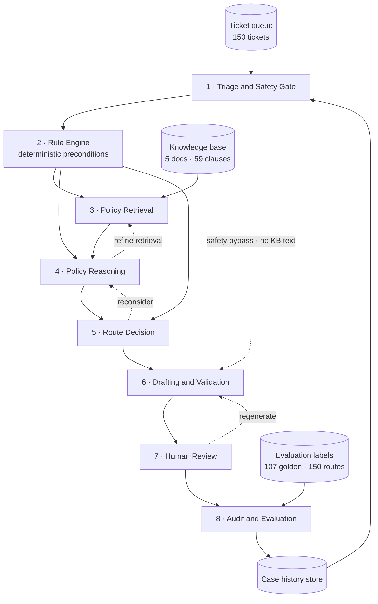

# High-Level Design — Support Ticket Triage & Resolution Agent

**Project:** `agentic-ai-capstone` · Northgate Bank consumer support queue
**Document type:** HLD. Subsystem responsibilities, technology choices, and the decisions that
are expensive to reverse.
**Status:** design approved, implementation not started
**Written:** 2026-08-13
**Companion docs:** [`data/README.md`](../data/README.md) (dataset) · `docs/Capstone_Project_Usecase&ExecutionPlan.docx` (brief) · `docs/lld_notes.md` (parked detail, not authoritative)

---

## 0. Scope of this document

This is the high-level design only. It answers *is this the right system* — what the
subsystems are, what each is responsible for, which technologies were chosen and why, and
which decisions everything else depends on.

It deliberately does **not** contain state schemas, function signatures, prompt shapes,
confidence weights, similarity thresholds, config keys or filenames. Those are low-level
design, and they will be written per subsystem immediately before that subsystem is built
(§10), when the numbers can come from measurement instead of guesswork. Early drafts of some
of that material are parked in `docs/lld_notes.md` — treat it as raw notes, not decisions.

The distinction that matters here is not abstraction level but **cost of reversal.** Anything
in this document is expensive to change once code exists. Anything absent from it is meant to
be tuned.

---

## 1. The contract

### 1.1 What the system does

For each ticket in the queue, produce **one route** and **one draft reply**, plus enough
recorded reasoning that a human can approve or correct it in under a minute.

| Route | Meaning | Count in dataset |
| --- | --- | --- |
| `AUTO_RESOLVE` | A KB clause fully answers the request and the customer meets its preconditions. Draft the answer. | 54 (36%) |
| `ESCALATE` | Correct handling requires a human queue. Draft an acknowledgement, route to a named target. | 52 (35%) |
| `REFUSE` | The request as framed cannot be done. Decline the framing, still offer the legitimate path. Seven of these also escalate internally (§5.2). | 19 (13%) |
| `ASK_MORE_INFO` | One specific missing fact blocks a decision. Ask for exactly that. | 25 (17%) |

### 1.2 Hard safety rules

Non-negotiable, and enforced structurally — in code paths and validators, never only in a
prompt. A prompt is a request; these are guarantees.

1. **Nothing is ever sent to a customer.** The system writes drafts to disk. There is no send
   path, no mail client, no CRM write-back. Enforced by absence.
2. **Every policy statement must trace to a retrieved chunk.** A reply may quote only a fee,
   limit, timeline or entitlement present in the chunks retrieved for *that* ticket.
   Verification is against the retrieved set, not against the knowledge base.
3. **No policy found ⇒ say so and escalate.** Never improvise a plausible timeline. Eight
   tickets test exactly this.
4. **Tone never drives refusal.** Anger, profanity, all-caps, threats to leave or post
   publicly are not grounds to refuse or downgrade. Six tickets are hostile messages wrapping
   a fully legitimate request; one of them is labelled `AUTO_RESOLVE`.
5. **Safety-critical content bypasses the policy machinery.** Threats toward a named person
   or branch, self-harm disclosure, suspected elder abuse, slurs at staff → immediate
   escalation with the verbatim message and a short human reply. No policy quote in the same
   breath. Never a refusal.
6. **Never request a full password, OTP, SSN or CVV** in a draft.

These six are the `must_not_contain` list in the golden dataset. Any hit is a hard failure
regardless of whether the route was right.

### 1.3 Definition of done

The twelve boxes in the brief's submission checklist, plus: a route-accuracy figure on all
150 tickets **and separately on the 45 hard ones**, zero `must_not_contain` hits, zero
hallucinated citations, and an audit record from which any single decision can be
reconstructed without re-running the agent.

---

## 2. Subsystem architecture

### 2.1 Components



The three dotted back-edges are the brief's required loops. They are architectural, not
implementation detail: each one exists because a specific class of ticket cannot be handled
in a single forward pass. Every loop is bounded, and **every bounded-out loop terminates in
`ESCALATE`** — a human is the fallback for everything, which is the only fallback that is safe.

### 2.2 Responsibilities

| # | Subsystem | Owns | Must not |
| --- | --- | --- | --- |
| 1 | **Triage and Safety Gate** | Sentiment, intent and entity extraction; safety classification; defensive PII scan; the bypass decision | Decide the route. It classifies the *message*, not the request's merit |
| 2 | **Rule Engine** | Deterministic policy preconditions computed from structured customer context; escalation-target lookup; all thresholds | Read free text. It operates on fields, not prose |
| 3 | **Policy Retrieval** | Clause-aware indexing; query construction; retrieving candidate clauses; guaranteed-context injection; detecting genuine absence of policy | Interpret. It returns candidates, not conclusions |
| 4 | **Policy Reasoning** | Which clauses *decide* the question, which merely *constrain* the wording, what facts are missing, whether policy was verified at all | Write customer-facing prose |
| 5 | **Route Decision** | Reconciling the Rule Engine's proposal with the reasoning proposal; final route, escalation target, and confidence | Retrieve or re-reason. It arbitrates between two existing proposals |
| 6 | **Drafting and Validation** | Route-appropriate reply text; citations; structural validation against the retrieved set and the safety rules | Change the route. If the draft cannot be made legal, it escalates rather than rewriting the decision |
| 7 | **Human Review** | Presenting decision, evidence and draft together; capturing the reviewer's action | Be optional. Nothing leaves without passing through it |
| 8 | **Audit and Evaluation** | Append-only decision record; metrics against the golden set; writing case history back | Be reconstructible only by re-running the agent |

Two data stores are part of the architecture rather than incidental: the **knowledge base** is
hand-authored source of truth (never generated), and the **case history store** is written
during a run and read by later tickets in the same run (§6).

### 2.3 Pipeline order, and one deliberate change from the brief

The brief specifies:

```
Ticket In → Sentiment & Policy Check → RAG Answer Draft → Route Decision
          → Confidence Re-check Loop → HITL Approval → Audit Log
```

Every stage survives. **One ordering changes: the route is decided before the reply is
drafted.**

If you draft first and route second, the draft becomes the evidence for the route. The model
writes a confident, helpful answer, then reads its own answer and concludes `AUTO_RESOLVE` —
because the answer sounds resolved. On the 45 hard tickets, where the obvious answer is the
wrong one, this failure is near-total. Routing first also cuts token spend on `ESCALATE` and
`REFUSE` tickets, which need a two-sentence acknowledgement rather than a policy explanation.

So the brief's "RAG Answer Draft" splits across subsystems 3–4 (retrieve and reason, before
the route) and subsystem 6 (draft, after it). No stage is dropped; the drafting step moves
downstream of the decision.

### 2.4 Why the safety bypass skips retrieval entirely

The abusive-content policy requires a short human reply for threats and self-harm
disclosures, and forbids pairing a policy quote with one. If safety-critical content flows
through the normal pipeline, the drafting subsystem has fee-policy clauses sitting in its
context and will use them — producing *"I'm sorry to hear that. Regarding your $35 overdraft
fee, under FEE-001…"*.

That is the worst output this system can produce, and an unbranched pipeline produces it
reliably. Hence the bypass: on a safety-critical flag, no knowledge-base text ever enters the
context window. This is why the branch belongs in the architecture and not in a prompt.

---

## 3. The four decisions everything else follows from

### D1 — Chunk on clause boundaries, not token windows

The brief suggests 500–800 token chunks with overlap. Taken literally, that splits a clause so
its identifier lands in one chunk and its eligibility conditions in the next. The agent then
retrieves the identifier, cites it correctly, and states conditions it never read. Groundedness
becomes unmeasurable: the citation is right and the content is invented.

Instead, chunk on the knowledge base's own structure — one chunk per policy clause, each
carrying its clause identifier as metadata. The token range becomes a ceiling for
over-long clauses rather than the primary rule.

The dataset was built for this. All 59 clauses have stable IDs under structured headings, and
`gen/validate.py` refuses to recognise an ID that isn't one. Honour that structure and
retrieval recall, citation precision and groundedness all become mechanical checks rather
than judgement calls. Ignore it and every downstream metric measures fluency instead.

### D2 — Compute policy preconditions deterministically, and give the model the results

One ticket reads: *"I've been with Northgate since 2019 and I don't think I've ever asked for
anything like this before."* The customer's prior-reversal count is `0`, so he is right, and
the one-time courtesy reversal applies → `AUTO_RESOLVE`.

Change that single structured field to `1` and the correct route becomes `ESCALATE` to Service
Recovery under the repeat-request clause — with the customer's sentence completely unchanged.
A language model reading that message will believe the customer every time.

So eligibility is computed from the structured record — dates, counts, tenure, segment — and
the **results** are handed to the model as established facts it is told not to re-derive. This
is the largest single accuracy lever in the project. Models are good at reading a clause and
writing prose; they are bad at arithmetic over fields you already hold.

### D3 — Confidence is composed from measurable signals, not self-reported

Asking a model for its own confidence yields roughly the same high number for everything, and
a number that never dips cannot drive a loop.

Confidence is therefore composed from several independently observable signals — retrieval
strength, whether a clause actually decides the question, whether the needed context fields
were present and unambiguous, and whether the two route proposals agree — with the model's own
opinion contributing a minority share. The exact weighting is LLD and will be fitted against
the golden set's confidence bands during the confidence phase.

What is architectural is the band structure the dataset implies:

| Route | Expected confidence band |
| --- | --- |
| `AUTO_RESOLVE` | high |
| `REFUSE` | high |
| `ESCALATE` | wide / mid |
| `ASK_MORE_INFO` | **low** |

`ASK_MORE_INFO` being deliberately low-confidence gives the loops their governing rule:

> Low confidence is a legitimate terminal state, never something to iterate away by relaxing
> toward `AUTO_RESOLVE`. Missing facts → `ASK_MORE_INFO`. Facts present but policy unclear →
> `ESCALATE`.

### D4 — Two independent route proposals, and their disagreement is the signal

The Rule Engine proposes a route from deterministic preconditions. Policy Reasoning proposes
one from the retrieved clauses. When they agree, the ticket is probably easy and confidence is
high. When they disagree, that *is* the hard case: confidence drops, the reconsider loop
fires, and an unresolved disagreement forces `ESCALATE`.

This yields a well-calibrated hard-case detector for free, with nothing extra to label. It
also means the deterministic rules need not be complete — only correct where they fire.

The Rule Engine wins outright in exactly two situations: safety-critical flags, and
unverifiable policy. Those are the two places where a persuasive message is most likely to
talk a model out of the right answer. Everywhere else the model has the better read of clause
text and the rules act as a check rather than an authority.

---

## 4. Technology choices

| Concern | Choice | Why |
| --- | --- | --- |
| Orchestration | **LangGraph** | The brief requires conditional branching and loops; explicit state and bounded cycles are the whole point here |
| Reasoning models | **Groq**, two tiers: a small fast model for classification, a large one for policy reasoning and drafting | Free tier. Using a 120B model to label sentiment is waste, not rigour |
| Embeddings | **Local sentence-transformers** | Forced — Groq serves no embedding endpoint. Also makes the pipeline zero marginal cost |
| Vector store | **Chroma**, persistent on disk | Metadata filtering on clause identifiers out of the box; no service to run for ~75 chunks |
| Human review UI | **Streamlit**, over an append-only queue | Append-only keeps the pipeline and the UI from contending; the UI is a demo surface, not the source of truth |
| Tracing | **Arize Phoenix**, local, minimal | Auto-instrumentation gives full per-node traces for two lines of setup and no account. Deliberately kept small |
| Metrics | **Custom evaluators** | Only our own code knows about clause IDs, expected citations and the `must_not_contain` list. Phoenix cannot infer any of that |

Nothing in subsystems 1–8 imports a provider SDK directly; model access goes through one
seam. Swapping to OpenAI or Azure later should be a configuration change, not a refactor.

### 4.1 Two subsystems the free tier makes mandatory

Both are infrastructure, not features, and both are architectural because retrofitting them
means touching every call site:

**A response cache.** Keyed on the full request content, persisted to disk. A full 150-ticket
run is several hundred model calls, and it will be re-run dozens of times while evaluators are
tuned. Without a cache you spend the day waiting on rate limits and re-paying for calls whose
inputs never changed. This also requires deterministic sampling settings, which is desirable
anyway — runs should be comparable.

**Retry with backoff and structured-output repair.** Free-tier rate limiting is routine, not
exceptional. On a schema validation failure the error is sent back for one correction attempt
before giving up. Both live behind the model seam, so no subsystem handles a rate-limit error.

---

## 5. Safety architecture

### 5.1 Three distinct signals, three different routes

Collapsing these into one "bad ticket → refuse" branch is the most common way this project
fails, and it accounts for roughly 25 tickets.

| Signal | Correct route |
| --- | --- |
| Threat, self-harm disclosure, suspected financial abuse | `ESCALATE` via the bypass — named target, verbatim message, short human reply, scripted crisis resource where applicable. **Never** `REFUSE` |
| A prohibited **request**: misstate a claim reason, backdate a dispute, alter a statement, disclose detection logic, access a third party's account, structure deposits | `REFUSE` — decline the framing, still offer the legitimate path. A bare "no" that strands a customer with a valid claim is also a failure |
| Discriminatory or sexual content | `REFUSE` with the approved script, stop the exchange in-channel, escalate for conduct review — **and the underlying service request is not dropped**, it transfers |
| Hostility around a legitimate request | Route on the **request**. Tone changes the drafting register and nothing else |

Safety classification is two-layer by design: deterministic patterns first (auditable, cheap,
cannot be argued out of firing — this is also where prompt-injection markers are caught), then
a model pass for the veiled cases that patterns cannot reach, such as an implied threat or
abuse inferred from *"my son handles my account now, please don't call the house."*

### 5.2 Route and escalation are orthogonal

52 tickets are `ESCALATE`, but **59 carry an escalation target.** The other seven are
`REFUSE` — structuring requests that must still be reported internally, inducements and
conduct cases that open a file regardless of what the customer is told.

So "where the case goes internally" is a separate output from "what we tell the customer," and
the data model must allow a target on a refusal. Treating escalation as a property of the
`ESCALATE` route alone makes seven tickets unrepresentable.

### 5.3 Some escalations are invisible to the customer

One ticket requires refusing a third-party access request *and* referring the account for a
financial-abuse review, while the reply gives no indication that the referral happened. If a
family member may be exploiting the customer, a draft saying "I've referred this to our
Conduct Review team" warns the wrong person.

So the draft and the audit trail deliberately diverge on some tickets, and visibility of an
escalation is an explicit property of the decision rather than an assumption. This is
invisible from the route label alone, which is why it belongs in the HLD.

---

## 6. Memory model

Two layers, and neither is chat history.

**Within-ticket.** The ticket's own conversation history, plus any reviewer feedback from
earlier attempts on the same ticket. Load-bearing: a first "one-time passcode not received"
contact routes differently from a third failed attempt, and the conversation history is the
only place that difference exists.

**Across tickets — case history.** Keyed by customer, seeded from each ticket's related-ticket
records, and appended to after every decision. Four customers in the dataset appear as a
single escalating story: a denied dispute becoming a complaint about staff becoming a
regulatory threat. The third ticket in such a thread should escalate faster, and to a
different target, than the first.

The right word is *case* history, not conversation memory. What it changes is the route, not
the tone.

This has one architectural consequence worth stating up front: because the store is written
during a run and read by later tickets in the same run, **tickets are processed in arrival
order, single-threaded.** Parallelising the queue would let a ticket be scored before its own
predecessor is recorded, silently breaking those four threads — a bug that shows up as a
mildly disappointing accuracy number rather than an error. If concurrency is ever needed,
partition by customer, never by index.

---

## 7. Human review model

Review is a gate, not a notification. Nothing reaches a customer under any configuration.

**What the reviewer sees matters as much as that they review.** The screen shows the retrieved
clauses *beside* the draft. A reviewer shown only the draft is judging fluency; a reviewer who
can see what the agent read is judging groundedness — which is the thing that actually
matters, and it turns the reviewer into the groundedness metric's ground truth.

Six reviewer actions, each with a distinct consequence: approve; approve and route to the
named queue; edit (both versions retained, so edit size becomes a quality signal); request
regeneration (returns to drafting with the reviewer's comment as input); reject; and escalate
as an override, which records a route disagreement.

**Three operating modes are architectural, not a convenience.** Interactive review suspends
the pipeline mid-run and resumes it — the honest implementation, and the demo. Simulated
review applies the golden set's expected reviewer action, for scoring end to end. Automatic
approval is for full-queue evaluation runs. Without the latter two, a human gate in front of
150 tickets means no metric ever gets produced. Every reported number must state which mode
produced it.

Reviewer **edit rate** and **override rate** are the closest things in this project to a
production quality signal. They are worth tracking from the first review session.

---

## 8. Auditability and evaluation strategy

### 8.1 The audit criterion

One append-only record per ticket per run. The test of sufficiency is a question, not a field
list:

> Could you defend this decision six months from now, without re-running the agent?

Which implies recording not just what was decided but what it was decided *from* — the
retrieval attempts and their results, the computed preconditions **together with their
inputs**, both route proposals, the confidence and its components, loop counts, the draft, the
reviewer's action, and the model and configuration versions in force.

Storing a precondition's inputs rather than only its verdict is what makes a record replayable.
"Eligible" is an assertion; "eligible — no prior reversal in 12 months, fee 7 days old, account
6 years old" is evidence.

### 8.2 What gets measured, and why

| Dimension | Question it answers |
| --- | --- |
| Route accuracy | Did we choose correctly — overall, per route, and **separately on the 45 hard tickets** |
| Escalation targeting | Right decision, right queue. A distinct failure from the route being wrong |
| Retrieval recall | Are the right clauses coming back at all. Everything downstream is capped by this |
| Groundedness | Is each required claim supported by the **retrieved chunks** — not by the draft's own prose, which measures only fluency |
| Citation integrity | Cited clauses within the expected set, and never a clause that was not retrieved |
| Safety | Any prohibited-content hit. A hard failure regardless of route correctness |
| Confidence calibration | Does confidence land in the expected band, and did the loop fire when it should have |
| Absence handling | For the eight unsupported tickets: escalated **and** stated the policy could not be verified. Both required |

Two **critical error classes** are tracked separately from accuracy, because their real-world
cost is not comparable to an ordinary miss:

- Refusing where the correct route was to help or escalate — a real customer denied service.
- Auto-resolving where the correct route was to escalate on a safety or fraud ticket — an
  account takeover or a self-harm disclosure handled by a bot.

Target for both: **zero.** Report aggregate accuracy last, not first; it inflates on the 65
easy tickets and says very little about the design.

Tracing and metrics are separate concerns and are built in that order. Traces answer "what did
it do and how long did it take." Metrics answer "was it right." Only the second requires
knowledge of the dataset's labels, and the observability tool must never become the reason the
evaluation doesn't exist.

---

## 9. Traceability — dataset traps to owning subsystem

The dataset was built around specific failure modes. Each has an owner. If a subsystem is ever
cut or simplified, this table names the tickets that start failing.

| Trap | Count | Owning subsystem |
| --- | --- | --- |
| Hostile tone, legitimate request | 6 | 1 Triage (classification separated from merit) + 3 Retrieval (the no-refusal-on-tone clause always in context) |
| Prohibited request needing a partial-help refusal | 12 | 3 Retrieval (refusal-standards clause guaranteed) + 6 Drafting |
| Safety-critical: threat, self-harm, elder abuse, slur | 7 | 1 Triage, both layers + the retrieval bypass (§2.4) |
| No policy exists in the knowledge base | 8 | 3 Retrieval (absence detection) + 8 Evaluation (both-conditions check) |
| Inverted route — the helpful action is the harmful one | 12 | 2 Rule Engine (wins outright on fraud signals) + 3 Retrieval (takeover clause guaranteed) |
| Preconditions unknowable from the message text | many | 2 Rule Engine (D2) |
| Two clauses pulling in opposite directions | several | 4 Policy Reasoning (deciding vs constraining) |
| Asking for a fact the ticket already supplied | several | 4 Policy Reasoning (missing facts validated against the ticket) |
| Prompt injection | 1 | 1 Triage, deterministic layer. Ticket text never enters a system prompt |
| Escalating multi-ticket threads | 4 customers | 6 Memory model + ordered single-threaded processing |
| Refusal that must also escalate internally | 7 | 5 Route Decision (§5.2) |
| Silent escalation | 1 | 5 Route Decision + 6 Drafting validation (§5.3) |

---

## 10. Delivery plan

Nine phases. Each ends with something demonstrable and a **numeric gate**, and the LLD for a
phase is written at its start — when the parameters can be measured rather than guessed.

Do not begin a phase until the previous gate passes. The failure this ordering prevents is
building all eight subsystems and discovering in week three that retrieval was never returning
the right documents.

| Phase | Subsystem | Demo | Gate |
| --- | --- | --- | --- |
| **P0** | Skeleton — schemas, config, loaders | Load the queue, print the route distribution | All 150 tickets parse with zero validation errors |
| **P1** | 3 Policy Retrieval | Query a fee question, see the right clause return with its conditions intact | **Document recall ≥ 0.90** on the golden set; all 59 clauses present in the index |
| **P2** | 1 Triage and Safety | Sentiment and flags across the 13-ticket dev batch | All 7 safety-critical tickets flagged; **all 6 tone traps flagged as not refusable** |
| **P3** | 2 Rule Engine + 4 Reasoning + 5 Routing | Route decisions, no drafts yet | 13/13 on the dev batch, then **≥ 70% overall and ≥ 55% on hard** across 150 |
| **P4** | 6 Drafting and Validation | Read one draft per route | **Zero hallucinated citations**, zero prohibited-content hits on the dev batch |
| **P5** | Confidence and all three loops | A ticket where a loop fires and changes the answer | In-band rate **≥ 0.70**; every loop provably terminates |
| **P6** | 6 Memory + 8 Audit | Walk one escalating thread, show the route hardening across tickets | Later tickets escalate at least as readily as earlier ones; a record is replayable |
| **P7** | 7 Human Review | Review five tickets live; edit one, regenerate one | All six actions work; interactive mode survives an app restart mid-review |
| **P8** | 8 Evaluation + tracing | Traces plus a generated report | Full 150-ticket run scored; **both critical error classes at zero** |
| **P9** | Docs and tests | Five-minute end-to-end demo | Tests green; a stranger can run the project from the README alone |

Target after tuning: **≥ 85% overall route accuracy, ≥ 70% on hard, zero critical errors, zero
hallucinated citations.** Optimise the hard-subset number; the aggregate follows it.

---

## 11. Out of scope

No sending, ever — no email, no CRM write-back, no webhook. No real customer data. No
fine-tuning. No multi-agent debate or planner-executor pattern: a single graph with explicit,
deterministic edges is far easier to audit, and this problem does not need more. No parallel
ticket processing (§6). No authentication on the review UI — it is a local surface, not a
deployment.

---

## 12. Open architectural questions

Tuning parameters are deliberately absent here; they belong to each phase's LLD. What remains
open at the architecture level:

1. **Which reasoning model.** Two candidates on the free tier. Compare hard-subset accuracy at
   P3, when there is finally something to measure. The answer is not obvious in advance, and it
   is a configuration change once P3 exists.
2. **Escalation-target granularity.** 23 distinct targets over 59 targeted tickets — several
   appear once. Consider scoring exact-target accuracy alongside a coarser
   correct-department-family metric, so that confusing two adjacent operations queues is not
   weighed the same as sending a fraud case to Bill Pay Support.
3. **Whether a model-based judge is trustworthy here.** Several prohibited-content checks are
   semantic and need a judge. Validate the judge against hand-labelled examples before
   reporting any number from it — an unvalidated judge is a random number generator with good
   manners.
4. **Whether the case-history store should carry decisions, or only dispositions.** Feeding a
   previous *decision* back to the agent risks compounding its own earlier mistakes across a
   thread. Feeding only human-confirmed dispositions is safer but sparser. Decide at P6.
