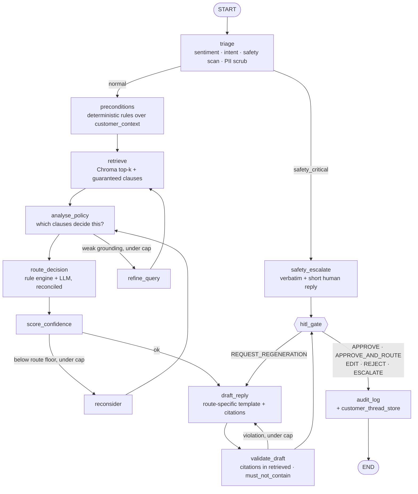

# LLD notes — parking lot

> **Status: raw notes, not decisions.** This file holds low-level design material drafted
> alongside the HLD on 2026-08-13, before any code existed. Every number in it is a first
> guess, not a measurement.
>
> The plan (HLD §10) is to write a proper LLD per subsystem at the start of its phase, when
> parameters can come from measurement. When that happens, the relevant section here is
> **superseded and should be deleted**, not left to rot alongside the real one.
>
> Read [`architecture.md`](architecture.md) first. Where the two disagree, the HLD wins.

---

## 1. Graph topology at node level

Twelve nodes. This is the LangGraph-shaped view; the HLD's subsystem diagram is the one that
survives a framework change.



**Replace this hand-drawn diagram with generated output as soon as the graph compiles:**

```python
print(graph.get_graph().draw_mermaid())      # or .draw_mermaid_png()
```

A hand-maintained diagram of code drifts from the code. A generated one cannot.

### 1.1 Wiring sketch

```python
from langgraph.graph import StateGraph, START, END

builder = StateGraph(GraphState)

for name, fn in [("triage", triage), ("preconditions", preconditions),
                 ("retrieve", retrieve), ("refine_query", refine_query),
                 ("analyse_policy", analyse_policy), ("route_decision", route_decision),
                 ("score_confidence", score_confidence), ("draft_reply", draft_reply),
                 ("validate_draft", validate_draft), ("safety_escalate", safety_escalate),
                 ("hitl_gate", hitl_gate), ("audit_log", audit_log)]:
    builder.add_node(name, fn)

builder.add_edge(START, "triage")
builder.add_conditional_edges("triage", after_triage,
    {"safety": "safety_escalate", "normal": "preconditions"})
builder.add_edge("preconditions", "retrieve")
builder.add_edge("retrieve", "analyse_policy")
builder.add_conditional_edges("analyse_policy", after_analysis,
    {"refine": "refine_query", "route": "route_decision"})
builder.add_edge("refine_query", "retrieve")                       # loop 1
builder.add_edge("route_decision", "score_confidence")
builder.add_conditional_edges("score_confidence", after_confidence,
    {"reconsider": "analyse_policy", "draft": "draft_reply"})      # loop 2
builder.add_edge("draft_reply", "validate_draft")
builder.add_conditional_edges("validate_draft", after_validation,
    {"repair": "draft_reply", "review": "hitl_gate"})              # loop 3
builder.add_edge("safety_escalate", "hitl_gate")
builder.add_conditional_edges("hitl_gate", after_review,
    {"regenerate": "draft_reply", "done": "audit_log"})
builder.add_edge("audit_log", END)

graph = builder.compile(checkpointer=checkpointer)
```

Routers are plain Python over state — no model call, no magic:

```python
def after_analysis(state: GraphState) -> str:
    weak = not state["policy_analysis"].policy_verified
    return "refine" if weak and state["retrieval_attempts"] < 2 else "route"
```

### 1.2 Three things to get right

1. **Every branch needs a key for every case.** LangGraph has no default edge; a router
   returning something absent from the mapping raises at runtime rather than falling through.
2. **`hitl_gate` hides a mode switch.** In interactive mode it calls `interrupt()`, suspending
   the whole graph and returning control to Streamlit; on resume the node is re-entered *from
   the top*, so it must handle "arriving fresh" vs "resuming with a decision". In auto and
   simulate modes it is an ordinary node.
3. **Loop caps live in the routers, not in the framework.** LangGraph's `recursion_limit` is a
   crash guard that raises an exception; the counters are the design, because they route to
   `ESCALATE` instead of dying.

### 1.3 Loop caps

| Loop | Trigger | Cap | Exit when capped |
| --- | --- | --- | --- |
| Retrieval refinement | No clause decides the question, or top-1 similarity below floor | 2 | `policy_verified = false` → `ESCALATE` |
| Confidence re-check | Confidence below the proposed route's floor | 2 | Force `ESCALATE` |
| Draft repair | Citation not in retrieved set, or prohibited-content hit | 2 | Force `ESCALATE` with a bare acknowledgement |

`reconsider` must **change an input** — re-run analysis with the disagreement stated
explicitly, optionally widening `k`. An identical retry is a wasted call that returns an
identical answer.

---

## 2. Graph state

One `TypedDict`, partial updates only, nothing mutated in place so a checkpointer can replay
any step.

| Field | Type | Written by | Notes |
| --- | --- | --- | --- |
| `run_id`, `ticket_id` | `str` | entry | `run_id` groups a batch; both in every log line |
| `ticket` | `Ticket` | entry | Pydantic model of the CRM record |
| `customer_history` | `list[CaseSummary]` | entry | From the thread store, seeded by `related_tickets` |
| `sentiment` | `Literal["neutral","frustrated","angry","distressed"]` | triage | The dataset's four labels exactly |
| `safety_flags` | `list[SafetyFlag]` | triage | `{code, clause_id, evidence_span, severity}` |
| `intent`, `entities` | `str`, `dict` | triage | Feeds query construction, not routing |
| `preconditions` | `dict[str, Precondition]` | preconditions | `{met: bool\|None, reason: str, inputs: dict}` |
| `retrieval_query` | `str` | retrieve / refine | Recorded per attempt |
| `retrieved` | `list[Chunk]` | retrieve | `{chunk_id, doc, policy_id, text, score, source}` |
| `retrieval_attempts` | `int` | retrieve | Cap 2 |
| `policy_analysis` | `PolicyAnalysis` | analyse_policy | See §4 |
| `rule_route`, `llm_route` | `Route \| None` | route_decision | Kept separately — the gap is the signal |
| `route`, `escalation_target` | `Route`, `str \| None` | route_decision | Target valid on `REFUSE` too |
| `escalation_visible_to_customer` | `bool` | route_decision | `False` for abuse referrals |
| `route_rationale` | `str` | route_decision | Human-readable, lands in the audit log |
| `confidence`, `confidence_parts` | `float`, `dict[str,float]` | score_confidence | Components stored for calibration |
| `recheck_attempts` | `int` | score_confidence | Cap 2 |
| `draft`, `cited_policy_ids` | `str`, `list[str]` | draft_reply | |
| `validation` | `ValidationResult` | validate_draft | `{ok, violations[], hallucinated_citations[]}` |
| `draft_attempts` | `int` | draft_reply | Cap 2 |
| `reviewer` | `ReviewerDecision \| None` | hitl_gate | `{action, comments, edited_draft, reviewed_at}` |
| `trace` | `list[NodeTrace]` | every node | `{node, started_at, ms, model, tokens, summary}` |

Write these models in P0, before any node. They are the project's real interface docs.

---

## 3. Retrieval parameters

All provisional; sweep in P1.

| Setting | First guess | Note |
| --- | --- | --- |
| Embedding model | `BAAI/bge-small-en-v1.5` | 384-dim, local, free |
| Chunking | One chunk per `###` clause; 800-token ceiling, 75-token overlap on overflow | ~59 clause + ~15 structural ≈ 75 chunks |
| Embedded text | `{doc_title}\n{scope_note}\n### {policy_id} — {title}\n{body}` | Prepending the scope note makes *absence* of coverage retrievable |
| `k` | 5 dense, plus the guaranteed set | Brief says 3–5 |
| Similarity floor | 0.35 cosine | **Sweep against the 8 no-policy tickets.** Too low and absence is never detected; too high and easy tickets escalate |
| Index refresh | Content-hash per file, skip unchanged | The KB is hand-edited source; expect frequent re-indexing |

**Query construction.** Do not embed the raw message — a 400-word all-caps rant embeds to a
vector dominated by outrage. Build the query from `subject` + triage's extracted intent and
entities + `product_area`. The raw message is for reasoning only.

**Guaranteed context** (from `routing_rules.yaml`, injected regardless of similarity):

| Condition | Always inject |
| --- | --- |
| Any ticket | `CON-010`, `CON-011` |
| `sentiment ∈ {angry, distressed}` | `CON-001`, `CON-002` |
| `category == conduct_and_prohibited` | all `CON-*` |
| `category == disputes_and_fees` | `DSP-006` |
| `product_area == digital_access` | `ACC-007`, `ACC-010` |

`CON-011` in context on every ticket costs ~150 tokens and is the cheapest available defence
against the tone traps.

**Do not cite guaranteed-context clauses to customers.** `CON-010` is the only one of the 59
that appears in the golden set's grounding claims but never in any ticket's
`expected_policy_ids` — it is an internal drafting standard. Quoting it at a customer is both
a citation error and a bad reply.

**Absence detection** needs two of three signals: top-1 below floor after both attempts; the
retrieved scope-note chunk names the topic as out of scope; analysis reports no deciding
clause. Then `ESCALATE` **and** the draft must carry the unverifiable-policy statement —
escalating without that sentence scores as wrong on those 8 tickets.

---

## 4. `analyse_policy` output contract

Structured, no prose. Separating *deciding* from *constraining* clauses is what makes
conflicting-guidance tickets tractable.

```json
{
  "deciding_clauses": [{"policy_id": "DSP-003", "why": "re-opened claim after denial"}],
  "constraining_clauses": [{"policy_id": "DSP-006",
                            "constraint": "must not explain how 'verified' was determined"}],
  "missing_facts": [],
  "policy_verified": true,
  "conflicts": [{"between": ["DSP-003", "DSP-006"],
                 "resolution": "escalate without explaining verification logic"}],
  "self_certainty": 0.7
}
```

`missing_facts` drives `ASK_MORE_INFO` and must be **validated against the ticket text** before
it can do so. Several tickets supply date, amount and merchant and are still `ASK_MORE_INFO`,
because the genuinely missing fact is something else — whether the merchant was contacted,
whether an entry is still pending. Re-asking for what is already there is its own failure mode.

---

## 5. Route reconciliation

```
rule_route  ← routing_rules.yaml fired against preconditions + safety_flags + category
llm_route   ← structured call over policy_analysis + preconditions + retrieved chunks

if safety-critical flag        → ESCALATE  (rules win outright, no model involvement)
elif not policy_verified       → ESCALATE  (rules win outright)
elif rule_route == llm_route   → that route, confidence bonus
elif rule_route is None        → llm_route (no rule covers this ticket)
else                           → disagreement: record both, confidence penalty,
                                 re-check loop; if unresolved → ESCALATE
```

---

## 6. Confidence formula

Provisional weights. Fit against the 107 golden bands in P5 and record what moved.

```
confidence = 0.30 · retrieval_strength       # normalised top-1, ≥1 clause chunk present
           + 0.25 · clause_coverage          # decides it 1.0 / partially 0.5 / none 0.0
           + 0.20 · precondition_determinacy # needed context fields present, unambiguous
           + 0.15 · route_agreement          # rule_route == llm_route → 1.0
           + 0.10 · self_certainty           # the model's own number, capped at 10%
```

Route floors, initialised from the golden bands:

| Route | Band | Golden records |
| --- | --- | --- |
| `AUTO_RESOLVE` | 0.80 – 1.00 | 30 |
| `REFUSE` | 0.75 – 1.00 | 17 |
| `ESCALATE` | 0.55 – 0.95 | 46 |
| `ASK_MORE_INFO` | 0.30 – 0.70 | 14 |

---

## 7. Audit record fields

`outputs/audit_logs/run_{run_id}.jsonl`, append-only, one record per ticket:

`run_id` · `ticket_id` · timestamps · config and prompt hashes · model IDs per node ·
`sentiment` · safety flags with evidence spans · every retrieval attempt (query, chunk IDs,
scores, policy IDs) · computed preconditions **with their inputs** · `rule_route` · `llm_route`
· final route + rationale · escalation target + visibility · confidence + components · all
three loop counters · draft text · cited policy IDs · validation result · reviewer action and
comments · tokens and latency per node.

---

## 8. Evaluators

`src/evaluation/`, each writing JSON + Markdown to `outputs/evaluation_reports/`.

| Evaluator | Measures | Golden field |
| --- | --- | --- |
| `route_accuracy_eval` | Overall, per-route P/R, 4×4 confusion matrix, **hard subset separately**, escalation-target accuracy | `expected_route`, `expected_escalation_target`, `difficulty` |
| `groundedness_eval` | Each required claim supported by the **retrieved chunks**. Two scores: mechanical (is the ID in the retrieved set) and judged (entailment against retrieved text) | `grounding_claims_required` |
| `citation_eval` | Cited ⊆ expected; **cited but not retrieved = hallucinated, hard failure**; constraint-only clauses cited = error | `expected_policy_ids` |
| `retrieval_eval` | Document recall@k, and clause-level recall | `expected_kb_sources`, `expected_policy_ids` |
| `safety_eval` | Prohibited-content scan — regex for literal items, judge for semantic ones | `must_not_contain` |
| `confidence_eval` | In-band rate; accuracy by confidence decile; did the loop fire when it should have | `expected_confidence_band` |
| `no_policy_eval` | Escalated **and** stated policy unverifiable. Both required | `no_policy_in_kb` |

Phoenix setup, deliberately minimal:

```bash
pip install arize-phoenix openinference-instrumentation-langchain
phoenix serve                                    # UI on localhost:6006
```

```python
from phoenix.otel import register
register(project_name="support-ticket-agent", auto_instrument=True)
```

LangGraph runs on LangChain callbacks, so the LangChain instrumentor captures every node, model
call and retrieval span with no further work. Phoenix *experiments* over the golden set are a
stretch goal, after the custom evaluators work.

---

## 9. Config keys

| File | Holds |
| --- | --- |
| `config/app_config.yaml` | Paths, chunk ceiling and overlap, `k`, similarity floor, all three loop caps, HITL mode, output dirs, run-ID strategy, log level |
| `config/model_config.yaml` | Provider, model ID per role, temperature, max tokens, embedding model, cache on/off, retry policy |
| `config/routing_rules.yaml` | Precondition definitions and thresholds, per-route confidence floors, guaranteed-clause sets, escalation-target map, safety-code → target map |

`routing_rules.yaml` is data so a compliance reviewer can read the thresholds without reading
Python: one courtesy reversal per 12 months, 60-day fee window, 30-day new-account boundary,
$2,500 and 3-disputes specialist thresholds. Changing a threshold must never mean touching a
node.

Model roles: `fast` = `llama-3.1-8b-instant` (sentiment, intent, query rewrite); `reason` =
`openai/gpt-oss-120b`, fallback `llama-3.3-70b-versatile` (analysis, routing, drafting, judges);
`embed` = local. `temperature: 0` everywhere so the cache is sound and runs are comparable.

Cache: on-disk at `.cache/llm/`, keyed `sha256(model, prompt, temperature, schema)`. A full
150-ticket run is roughly 600–900 calls.

---

## 10. Folder structure

Brief's structure kept as-is; additions marked `+`.

```
agentic-ai-capstone/
├── config/            app_config · model_config · routing_rules
├── data/              tickets · knowledge_base · evaluation      [done]
├── gen/               seeded generator + validate.py             [done]
├── src/
│   ├── main.py
│   ├── graph/         support_graph · graph_state · nodes · edges
│   ├── agents/        triage · rag · policy · sentiment · response
│   ├── routing/     + rules_engine · target_map
│   ├── retrieval/     document_loader · chunking · vector_store · retriever
│   │                + query_builder
│   ├── memory/        conversation_memory · customer_thread_store
│   ├── hitl/          approval_queue · reviewer_actions · approval_ui_stub
│   ├── safety/        policy_checker · refusal_templates · abuse_detection
│   ├── evaluation/    arize_evaluator · route_accuracy_eval · groundedness_eval
│   │                  confidence_eval
│   │                + citation_eval · retrieval_eval · safety_eval · no_policy_eval · report
│   ├── logging/       audit_logger · trace_logger
│   └── utils/         schemas · constants · helpers
│                    + llm.py                    (provider factory, cache, retry)
├── app/             + streamlit_app.py
├── notebooks/         rag_experimentation · langgraph_flow_demo · evaluation_analysis
├── tests/             test_routing · test_policy_check · test_refusal
│                      test_rag_grounding · test_hitl_flow
├── outputs/           drafted_replies · audit_logs · evaluation_reports
│                    + approval_queue.jsonl · reviews.jsonl · customer_threads.db
└── docs/              architecture.md · lld_notes.md · participant_guide.md
                       evaluation_rubric.md · demo_script.md
```

`src/logging/` shadows a stdlib name — safe under Python 3's absolute imports, but the first
place to look if an import ever behaves oddly. Gitignore `.chroma/` and `.cache/`; never commit
the index.

---

## 11. Worked trace — `TCK-1143`

The easiest possible ticket, end to end, to make the tables above legible. Expected:
`AUTO_RESOLVE`, `easy`, band `[0.80, 1.00]`, reviewer `APPROVE`.

> *"I got hit with a $35 overdraft fee on 8/4. My rent auto-payment cleared the same morning my
> paycheck was supposed to land and the paycheck came in about six hours later. I've been with
> Northgate since 2019 and I don't think I've ever asked for anything like this before."*

| Node | Output |
| --- | --- |
| `triage` | `sentiment: neutral`; no safety flags; `intent: "overdraft fee reversal request"`; `entities: {fee_type: overdraft, amount: 35, fee_date: 2026-08-04}` |
| `preconditions` | `prior_fee_reversals_12m = 0` ✓ · fee age 7 days < 60 ✓ · `tenure_months = 79` ✓ · fee type eligible ✓ · `segment: Consumer` ✓ → **`FEE-001: ALL MET`**, `FEE-002: N/A` |
| `retrieve` | `FEE-001` (0.79), `FEE-006` (0.61), `FEE-002` (0.58), fee-limits table (0.52), `TRB-007` (0.41); guaranteed `CON-010`, `CON-011`, `DSP-006` |
| `analyse_policy` | deciding `FEE-001`; constraining `DSP-006`; `missing_facts: []`; `policy_verified: true`; `self_certainty: 0.85` |
| `route_decision` | `rule_route = llm_route = AUTO_RESOLVE` → agree. No target |
| `score_confidence` | `0.30(0.79) + 0.25(1.0) + 0.20(1.0) + 0.15(1.0) + 0.10(0.85) = 0.92` ≥ 0.80 floor → no loop |
| `draft_reply` | One-time courtesy reversal under `FEE-001`, up to $140, posting in 1–2 business days, once per 12 months. Cites `FEE-001`. No outcome promise beyond the clause (`DSP-006`) |
| `validate_draft` | `FEE-001` ∈ retrieved ✓ · no prohibited content ✓ · "1–2 business days" verbatim in the `FEE-001` chunk ✓ |
| `hitl_gate` | Reviewer sees draft + five chunks + `FEE-001: ALL MET` with inputs → `APPROVE` |
| `audit_log` | Record written; thread store updated for `CUST-0001` |

Now flip one field — `prior_fee_reversals_12m: 1` — and the customer's message is unchanged, but
`FEE-001` becomes unmet, `FEE-002` applies, `rule_route` becomes `ESCALATE → Service Recovery`,
and if the model still says `AUTO_RESOLVE` because it believed *"I don't think I've ever asked
before"*, the disagreement penalty drops confidence below 0.80 and the re-check loop fires.

That contrast is HLD D2 and D4 in a single ticket. Worth stepping through by hand before writing
any code.

---

## 12. Parameters to sweep

Tracked here rather than in the HLD, because these are expected to change:

1. **Confidence weights** (§6) — fit against the 107 golden bands at P5.
2. **Similarity floor** (§3) — sweep against the 8 no-policy tickets at P1.
3. **`k`** — 5 is the brief's ceiling; test whether the guaranteed set makes a smaller dense `k`
   viable.
4. **Chunk ceiling** — 800 tokens; check how many of the 59 clauses actually overflow. If none
   do, the recursive splitter is dead code and the overlap parameter is moot.
