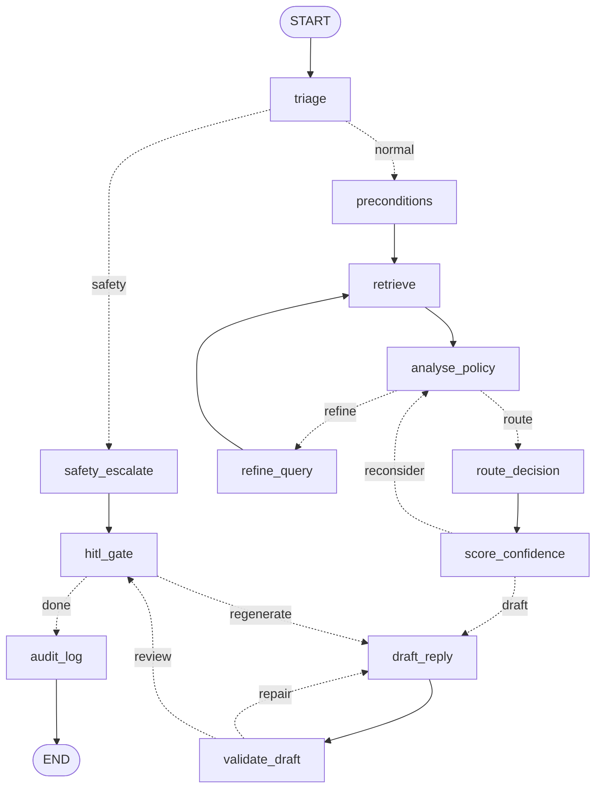

# How the agent works — P0

One ticket goes in, one reviewed draft comes out. This document explains that path and where
each part of it lives in the code. It replaces `lld_p0_skeleton.md` and
`p0_code_walkthrough.md`.

For *why* the architecture is shaped this way, read `architecture.md` first. This is the *how*.

---

## 1. Run it first

```bash
python -m src.main --gate                              # 10 structural checks, ~1s
python -m src.main --ticket TCK-1143 --stub-retrieval --walk -v
python -m src.main --draw                              # the diagram below, generated
python -m pytest tests/ -v                             # 59 tests, no langgraph needed
```

Nothing here needs an API key, an index, or torch. `--stub-retrieval` swaps in a retriever that
returns nothing; `--walk` runs the graph in plain Python instead of LangGraph.

---

## 2. The graph



Dashed edges are conditional. Three cycles and one branch:

| | Path | Cap | What happens when it runs out |
| --- | --- | --- | --- |
| Loop 1 | `analyse_policy → refine_query → retrieve` | 2 | `policy_verified` stays False → `route_decision` escalates |
| Loop 2 | `score_confidence → analyse_policy → route_decision` | 2 | `score_confidence` forces ESCALATE, or ASK_MORE_INFO if facts are missing |
| Loop 3 | `draft_reply → validate_draft` | 2 | `validate_draft` forces ESCALATE with a bare acknowledgement |
| Bypass | `triage → safety_escalate → hitl_gate` | — | Skips retrieval entirely |

Every capped loop ends in escalation, because a human is the only safe fallback.

---

## 3. One ticket, node by node

Take TCK-1143: *"I got hit with a $35 overdraft fee on 8/4… I don't think I've ever asked for
anything like this before."*

**`triage`** — reads the message, writes `sentiment`, `safety_flags`, `intent`, `entities`.
It classifies the *message*, never the request's merit. Six tickets in the set are hostile with
a completely legitimate request, and letting tone reach the route is the headline failure mode.

**`preconditions`** — reads `customer_context`, writes verdicts. `prior_fee_reversals_12m == 0`
means the one-time courtesy reversal applies. Change that field to `1` and the correct route
becomes ESCALATE, with the customer's sentence completely unchanged — which is why this is
computed in Python and handed to the model as a fact, not left for the model to infer.

**`retrieve`** — builds a search string from the structured signals (not the raw message) and
calls the P1 retriever. Returns clause chunks plus the guaranteed-context clauses that are
injected on every ticket regardless of score.

**`analyse_policy`** — decides which clauses *decide* the question and which merely *constrain*
the wording, what facts are missing, and whether policy was verified at all. If not verified
and budget remains, loop 1 fires.

**`route_decision`** — reconciles two independent proposals:

```
safety-critical flag   -> ESCALATE   rules win outright, model not consulted
policy not verified    -> ESCALATE   rules win outright
rule == llm            -> that route
rule is None           -> llm_route  (no rule covers this ticket)
otherwise              -> hold at ESCALATE, let the confidence loop look again
```

The order matters. The two rules-win cases are exactly where a persuasive message is most
likely to talk a model out of the right answer, so they are checked before the model's opinion
is consulted at all.

**`score_confidence`** — composes a score and compares it to the floor *for that route*. Below
the floor, loop 2 sends the ticket back to re-analyse. Capped, it resolves **upward**: missing
facts → ASK_MORE_INFO, otherwise ESCALATE. Never toward AUTO_RESOLVE.

**`draft_reply`** — writes the reply. The route is an *input* here. Drafting first would make
the draft the evidence for the route ("it sounds resolved, so AUTO_RESOLVE"), which fails on
the 45 hard tickets.

**`validate_draft`** — checks every cited policy ID against what was actually retrieved. Two
different failures: *hallucinated* (cited but never retrieved — the model invented a policy)
and *uncitable* (retrieved but internal-only, like CON-010).

**`hitl_gate`** — every path passes through here, including the bypass. Nothing reaches a
customer under any configuration.

**`audit_log`** — writes the record, then the case-history entry, in that order.

### The bypass

If triage raises a safety-critical flag (threat, self-harm, suspected financial abuse), the
ticket skips straight to `safety_escalate`, which returns `retrieved=[]` and
`context_block=""`. Not for speed — the context has to be *provably* empty, because otherwise
the drafting node has fee clauses sitting in context and produces:

> *"I'm sorry to hear that. Regarding your $35 overdraft fee, under FEE-001…"*

Route is ESCALATE, never REFUSE. A person disclosing a crisis is not a policy violation. And
for suspected financial abuse, `escalation_visible_to_customer` is False — telling the customer
we referred it warns exactly the person who may be exploiting them.

---

## 4. Where things live

```
config/
    app_config.yaml       paths, retrieval params, loop caps, recursion limit, hitl mode
    model_config.yaml     provider, per-role models, cache, retry
    routing_rules.yaml    guaranteed context, safety→queue map, confidence floors
src/
    main.py               CLI: run a batch, print the report, run the gate
    graph/
        graph_state.py    what flows through the graph; reducers; router helpers
        nodes.py          the twelve nodes
        edges.py          the five routers + topology as data
        support_graph.py  builds the LangGraph; also a plain-Python walker
    utils/
        schemas.py        every typed object; the loaders
        constants.py      the closed vocabularies
        llm.py            Groq client, response cache, retry  (unused until P2)
        config.py         YAML loading, repo-root paths
    logging/
        trace_logger.py   the @traced decorator
        audit_logger.py   the append-only record
    memory/
        customer_thread_store.py   case history across tickets
    hitl/reviewer_actions.py       the six reviewer actions
    retrieval/            P1, unchanged
    agents/ routing/ safety/       empty; each __init__ names its phase
tests/                    59 tests, all runnable with only pydantic + PyYAML
```

One deviation from the folder plan in `lld_notes.md` §10: `outputs/customer_threads.jsonl`
rather than `.db`. The store is append-only and a few hundred rows, so sqlite buys indexes
nobody queries and costs greppability. Say if you'd rather have sqlite.

---

## 5. Five rules the code follows

**Routers choose, nodes write.** A router takes state and returns a string; it never mutates.
When a loop caps, the *node* forces the route. If a router could change the route, the audit
record and the path actually taken could disagree and nothing would tell you which lied.

**Reducer keys return the delta.** `trace`, `retrieval_log`, `loops_capped` and `notes` are
annotated with `operator.add`, so LangGraph concatenates them:

```python
return {"trace": state["trace"] + [t]}   # wrong — duplicates everything so far
return {"trace": [t]}                    # right
```

Where a node can run more than once, the append needs a `not in` guard — see the one in
`route_decision`.

**Increment, then test the cap.** This was a real bug. `score_confidence` originally checked
the cap before counting the current pass, so the counter read 2 by the time the router looked:
the router stopped looping, but the node never ran its forcing branch, and the ticket left with
a below-floor confidence and its original route. *The loop appeared to work and did nothing.*

**Nothing is mutated in place.** A checkpointer snapshots state between nodes; mutating a list
an earlier snapshot points at makes the replay lie.

**Every branch needs a key for every case.** LangGraph has no default edge — an unmapped router
return value raises at runtime, on ticket 94 of 150.

---

## 6. What is real and what is a stub

Anything that is pure Python over inputs we already have is **final**. Everything model-shaped
is a deterministic placeholder, labelled at the top of its docstring.

| Node | P0 | Filled by |
| --- | --- | --- |
| `triage` | STUB | P2 |
| `preconditions` | PARTIAL — 2 worked examples | P3 |
| `retrieve` | **REAL** | — |
| `refine_query` | **REAL** (LLM rewrite added in P2) | — |
| `analyse_policy` | STUB | P3 |
| `route_decision` | **REAL** reconciliation, stub proposals | P3 |
| `score_confidence` | Stub score, **REAL** cap handling | P5 |
| `draft_reply` | STUB | P4 |
| `validate_draft` | **REAL** citation check, stub content scan | P4/P8 |
| `safety_escalate` | **REAL** structure, stub wording | P2/P4 |
| `hitl_gate` | **REAL** for auto/simulate | P7 (interactive) |
| `audit_log` | **REAL** | — |

Two stubs whose weaknesses you should know:

- **`triage` leaves `intent` empty on purpose.** Every ticket carries `tags` like
  `["overdraft_fee", "courtesy_reversal"]`, which look like a free 90% on intent extraction.
  They are generator metadata; a real CRM export would not ship pre-labelled with the answer.
  Leaving it empty also makes P2 measurable — retrieval recall should *rise* when real intent
  arrives, and if it doesn't, triage is extracting the wrong fields.
- **`analyse_policy`'s proxy is over-generous.** It calls policy verified when any citable
  clause came back, but a clause can be retrieved without deciding the question. Expect P3 to
  score *worse* than the stub before it scores better. That is not a regression.

### Driving a branch without a model

Stub nodes read `state["stubs"]`. A plain value applies every pass; a `Passes([...])` value is
consumed one element per pass:

```python
stubs = {"confidence": 0.10, "policy_verified": Passes([False, False, True])}
```

`Passes` is a distinct type rather than "any list means per-pass" because several stub values
are legitimately lists — `safety_flags=[{...}]` would otherwise hand back one dict, and the
resulting error points three functions away from the bug.

---

## 7. Two things the data taught us

**`ConversationTurn.role` has three values, not two.** The schema was written allowing
`customer` and `agent` and raised on the first run: 6 turns across 4 tickets are `system` —
internal events, not customer speech.

```
TCK-1044  "Claim NG-CLM-338217 resolved: no error found. Denial letter mailed."
TCK-1101  "Profile locked: 5 failed sign-ins. Source IP geolocation: inconsistent."
TCK-1112  "Mobile deposit MD-77201883 rejected: image quality - front image unreadable."
```

None of those is colour. TCK-1044's line is the re-opened-claim trigger. TCK-1101's is the
fraud signal that makes it an inverted-route ticket. They are facts to reason from and text
that must never be quoted — pasting "Source IP geolocation: inconsistent" into a reply is the
detection-logic disclosure DSP-006 prohibits. Typed as `str`, all of that would have parsed
fine and been lost.

**The two label files have different coverage.** `expected_routes.json` labels all 150;
`golden_dataset.json` covers 107. The "7 REFUSE tickets that also carry an escalation target"
figure counts over the 150 — one of them, TCK-1099, has no golden record. So: route accuracy
belongs on the 150, groundedness and citations can only be scored on the 107. A metric that
quietly picks the narrower file reports a denominator nobody expects.

---

## 8. Case history

`src/memory/customer_thread_store.py`. Four customers appear as one escalating story, and the
third ticket in such a thread should escalate faster, and to a different target, than the first.

A prior ticket can arrive from two sources, and each owns different fields:

- **disposition** comes from the dataset's `related_tickets` (ground truth). Ours is a draft
  pending review, and feeding the agent its own earlier output means one mistake on ticket 1
  becomes three across the thread, each *more* confident because corroborated by the last.
- **route and escalation_target** come from our own run. The seed has neither, and "escalate to
  a different target than last time" needs to know the last target.

Two safeguards: `history_for()` filters on `created_at`, so a re-run cannot let ticket 1 decide
using ticket 3's outcome; and `audit_log` writes the audit record *before* the thread entry, so
a crash between them never leaves history for a decision that was never recorded.

Worth knowing: in this dataset every prior-ticket relationship is already declared in
`related_tickets`, so the observed path currently contributes nothing extra. The arrival-order
sort and the single-threaded rule are guarantees for P6, not behaviour you can see today.

---

## 9. Status and open items

`python -m src.main --gate` is **green** — 150 tickets parse, 107 golden records, 150 route
labels, every node reachable, every router key mapped, every loop with a declared exit.
59 tests pass. A full 150-ticket run reaches `audit_log` on every ticket.

**The route distribution from P0 means nothing** — it is a property of the stubs, and
`print_report` says so in its output.

Open:

1. **P1's gate has never been run for real.** Run `python scripts/build_index.py` then
   `python -m src.evaluation.retrieval_eval`. Everything downstream is capped by retrieval
   recall, so no accuracy figure from this pipeline means anything until that number exists.
2. `entities` is a dict in state and a list in the query, flattened in `retrieve`. When P2
   extracts real entities (`fee_within_60_days` is already blocked on `entities.fee_date`) it
   will want a schema — a loose dict will hide typos.
3. Second safety layer: its own node, or inside `triage`? Its own is more traceable and costs a
   super-step on every ticket. Decide before writing the prompt.
4. Keep `Passes` once the real nodes land? It is P0 scaffolding, but scripting a loop without a
   model may stay useful in tests.
