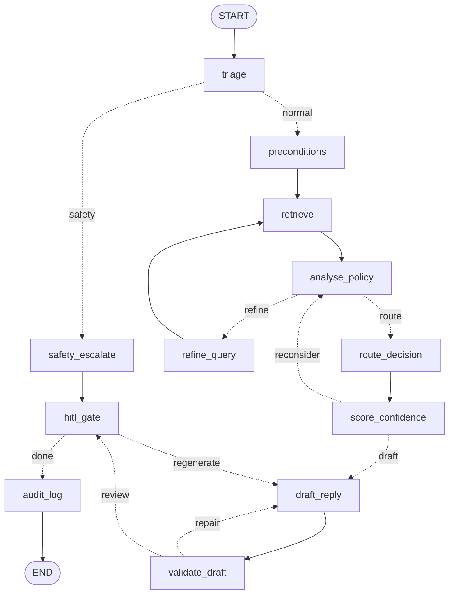

# How the agent works

One ticket goes in, one reviewed draft comes out. This is the how; `architecture.md` is the why.

Replaces `p0_flow.md`, which covered the skeleton before the reasoning existed.

---

## 1. Run it

```bash
python -m src.main --gate                                  # every gate that runs offline
python -m src.main --ticket TCK-1143 --no-model --walk -v   # one ticket, no API key
python -m pytest tests/ -v                                  # no API key, no index
```

Human review (P7) needs `graph.checkpointer: sqlite` in `config/app_config.yaml`:

```bash
python -m src.main --sample --hitl interactive   # suspends each ticket at the review gate
streamlit run app/streamlit_app.py               # the review surface — docs/human_review.md
```

With a key (`export GROQ_API_KEY=...`) and an index (`python scripts/build_index.py`):

```bash
python -m src.main --sample                    # 13-ticket dev batch, real models
python -m src.main --all                       # the full queue
python -m src.evaluation.route_eval            # route accuracy + critical errors
python -m src.evaluation.retrieval_eval --compare   # bm25 vs dense vs hybrid
```

Useful switches: `--no-model` (deterministic layers only), `--engine bm25|dense|hybrid`,
`--walk` (plain-Python executor, no langgraph), `--stub-retrieval`,
`--hitl auto|simulate|interactive`.

---

## 2. The graph



Three bounded loops, each capped at 2 and each ending in escalation, because a human is the
only safe fallback:

| Loop | Trigger | Exit when capped |
| --- | --- | --- |
| Retrieval refinement | no clause decides the question | `route_decision` escalates on unverified policy |
| Confidence recheck | score below the route's floor | ESCALATE, or ASK_MORE_INFO if facts are missing |
| Draft repair | hallucinated citation or prohibited content | ESCALATE with a bare acknowledgement |

Plus one branch: a safety-critical flag skips straight to `safety_escalate`.

---

## 3. What each node does

**`triage`** — two layers. Deterministic patterns (`safety/policy_checker.py`) run first: free,
auditable, impossible to argue out of firing. Then one `fast`-model call for what patterns
cannot reach. **The model can only add flags, never remove them.** Also extracts sentiment,
intent, and the entities the rule engine needs — a fee date, an amount, a merchant.

**`preconditions`** — `routing/rules_engine.py`. Eligibility computed from the structured
record and handed downstream as fact. `met` is a tri-state: `None` means "not determinable",
which drives ASK_MORE_INFO. Collapsing it to `False` would assert the opposite of what we know.

**`retrieve`** — hybrid: dense (Chroma + bge-small) and BM25, fused by Reciprocal Rank Fusion.
Guaranteed clauses are injected on top of `k`, never in competition with it.

**`analyse_policy`** — which clauses *decide* the question, which merely *constrain* the
wording, what is genuinely missing. Any clause ID the model names that was not retrieved is
dropped here, so a hallucinated citation cannot reach the draft.

**`route_decision`** — two independent proposals, reconciled:

```
safety-critical flag        -> ESCALATE   rules win outright, model not consulted
policy not verified         -> ESCALATE   rules win outright
neither proposed anything   -> ESCALATE   None == None is not agreement
rules == model              -> that route
no rule fired               -> the model's proposal
model unusable              -> the rules' proposal
they disagree               -> hold at ESCALATE, let the confidence loop look again
```

Order is load-bearing: the two rules-win cases resolve before the model's opinion is consulted
at all, because that is exactly where a persuasive message would otherwise win. **The model is
never shown `rule_route`** — telling it would turn a second opinion into agreement.

**`score_confidence`** — five weighted signals (§5), compared to the floor *for that route*.

**`draft_reply`** — route-specific drafting. The route is an *input*; drafting first would make
the draft the evidence for the route.

**`validate_draft`** — citations checked mechanically against what was retrieved, plus a
deterministic prohibited-content scan. Two distinct failures: *hallucinated* (never retrieved)
and *uncitable* (internal-only, like CON-010).

**`hitl_gate`** — every path passes through, including the bypass. Nothing reaches a customer.
`auto` and `simulate` decide in code; `interactive` calls `interrupt()` and suspends the graph
until a person acts, which is the whole of P7. See `human_review.md`.

**`audit_log`** — the record first, then case history. If the second write fails you still
have a complete record of the decision.

### The safety bypass

`safety_escalate` returns `retrieved=[]`, `context_block=""`, and a fixed reply with no model
call. Not for speed — the context has to be *provably* empty, because otherwise a crisis
disclosure gets drafted with fee clauses in the window:

> *"I'm sorry to hear that. Regarding your $35 overdraft fee, under FEE-001…"*

Route is ESCALATE, never REFUSE. A person disclosing a crisis is not a policy violation.

---

## 4. Retrieval

Three interchangeable backends, all presenting the same interface so `Retriever` cannot tell
them apart:

| Engine | Needs | doc recall@5 |
| --- | --- | --- |
| `bm25` | nothing — pure stdlib, reads the markdown | **0.921** (hard 0.937) |
| `dense` | Chroma + torch + a built index | not yet measured |
| `hybrid` | both | not yet measured |

BM25 exists because dense embeddings blur exact tokens: `FEE-001` and `FEE-006` sit almost on
top of each other in vector space. Two findings from building it:

**Section chunks had to be down-weighted.** The 19 "decision quick reference" chunks are
keyword tables that match every query. Measured on the 99 golden tickets with a policy:

| weights | doc@5 | clause | scope signal |
| --- | --- | --- | --- |
| section 1.0, scope 1.0 | 0.870 | 0.606 | 0.625 |
| section 0.3, scope 0.6 | **0.926** | **0.690** | 0.625 |
| section 0.3, scope 0.3 | 0.926 | 0.690 | **0.000** ← the trap |

The two weights have to move independently. Damping both looks like an improvement on the
headline number and silently destroys absence detection, because signal 2 for "no policy
covers this" *is* a scope note out-ranking every clause.

**An exact clause ID is a lookup, not a search.** Querying `FEE-001` returned TRB-002 first,
because TRB-002 cross-references FEE-001 once and is shorter, so BM25's length normalisation
floated the cross-reference above the clause. No term weighting fixes that — the text really
does say what BM25 thinks it says. The fix is a metadata bonus on the chunk's own `policy_id`.

Fusion is RRF, not a weighted score blend: cosine lives in 0..1 and BM25 is unbounded, so any
normalisation is wrong for some query. RRF uses ranks only. The dense cosine survives on every
hit that dense retrieved, so the similarity floor and absence detection keep working unchanged.

---

## 5. Confidence

```
0.30  retrieval_strength        top dense similarity, rescaled; injected clauses excluded
0.25  clause_coverage           decides 1.0 / only constrains 0.5 / nothing 0.0
0.20  precondition_determinacy  fraction of rules that resolved either way
0.15  route_agreement           rules == model 1.0, disagree 0.0, no rule fired 0.5
0.10  self_certainty            the model's own number, capped at a minority share
```

Weights are provisional and get fitted against the 107 golden bands in P5. What is settled is
that every component is measurable outside the model, so a persuasive ticket cannot talk the
score up. A capped loop resolves **upward** — missing facts to ASK_MORE_INFO, otherwise
ESCALATE. Never toward AUTO_RESOLVE.

---

## 6. Robustness

| Failure | Behaviour |
| --- | --- |
| Malformed JSON from the model | one repair pass with the error quoted back, then give up |
| Any transport exception | wrapped as `StructuredOutputError` — one handler, not one per SDK error |
| Model completely unavailable | deterministic layers only; ticket escalates with a bare acknowledgement |
| A single ticket raises | logged, skipped, the run continues (`run.stop_on_error: false`) |
| Rate limit / 5xx | exponential backoff with jitter; never retried on 400/401 |
| Primary model saturated | fallback model tried once, cached under the primary key, answering model recorded |
| Index missing | `--engine bm25` needs none |
| Draft cannot be produced | ESCALATE, never a guess |

Every model call is cached on disk keyed by `sha256(provider, model, prompt, system,
temperature, schema)`. Failed calls are never cached — a cached failure replays forever.

---

## 7. Where things live

```
config/           app_config · model_config · routing_rules   (all thresholds are data)
app/
  streamlit_app.py  the review surface — rendering only, no decisions
src/
  main.py         CLI: run a batch, print the report, run the gates
  graph/          graph_state · nodes · edges · support_graph
  hitl/           reviewer_actions · approval_queue · review_service
  agents/         base (structured calls) · triage · policy · response
  routing/        rules_engine · target_map · confidence
  safety/         policy_checker (deterministic patterns)
  retrieval/      document_loader · chunking · vector_store · bm25 · hybrid · retriever
  memory/         customer_thread_store
  evaluation/     retrieval_eval · route_eval · evaluators · report
  routing/        + thread_pressure
  logging/        trace_logger · audit_logger · replay
  utils/          schemas · constants · llm · config · tracing (Phoenix, off by default)
tests/            none requiring an API key or an index
```

Dependency direction: `app/` → `src/hitl/` → `src/graph/`, and it does not run back. That is
why `review_payload` — what the reviewer is shown — lives in `graph_state.py` rather than in
the review service: `hitl_gate` has to build it, and `src/graph/` must not import `src/hitl/`
beyond `reviewer_actions`.

---

## 8. Measured status

Everything below was run in this repo. Nothing is projected.

| Gate | Result |
| --- | --- |
| P0 topology | **green** — 10 structural checks |
| P1 doc recall@5, BM25 alone | **0.921** (gate 0.90), hard 0.937, false-absence 0.000 |
| P1 dense / hybrid | **not yet measured** — needs `scripts/build_index.py` |
| P2 safety-critical flagged | **2/2** |
| P2 tone traps not flagged | **6/6**, and zero false positives across all 150 |
| P2 prohibited requests caught by patterns | 11/12 (TCK-1085 is left to the model layer) |
| Rule engine | fires on 20/150, **100% correct where it fires** |
| P3 route accuracy, deterministic only | 0.447 overall, **0 critical errors** |
| P3 route accuracy, full pipeline | **needs a key** — `python -m src.evaluation.route_eval` |
| P4 citation integrity | **1.000** |
| P5 confidence in-band | **0.851** (gate 0.70) |
| P6 audit replayability | **150/150** |
| P6 thread pressure | TCK-1125 lifts to Executive Complaints; TCK-1109 stays REFUSE under it |
| P8 groundedness | 0.761 (gate 0.85) — retrieval-bound |
| P8 no-policy handling | 0.625 — the 5 of 8 the scope signal reaches without a model |
| P7 six actions, over the real graph | **6/6**, each with its distinct effect — see below |
| P7 regeneration loop | re-enters drafting, caps at 3, terminates into audit |
| **P7 restart durability** | **NOT YET RUN** — the one thing that needs the real checkpointer |
| Tests | 109 passing before P7; `tests/test_hitl.py` adds 22 cases that have not been executed |

The deterministic-only 0.447 is the floor, not a disappointment: with no model there is no
`llm_route`, so every non-REFUSE ticket falls to ESCALATE. Safe, unhelpful, and zero critical
errors. The model is what turns escalations into resolutions.

### P7, honestly

`tests/test_hitl.py` (21 functions, 22 cases) **has not been run**. The environment P7 was built
in had no `langgraph`, `langgraph-checkpoint-sqlite`, `streamlit` or `pytest` and no way to
install them, so nothing has touched the real LangGraph runtime. Close that first:

```bash
pip install -r requirements.txt
python -m pytest tests/test_hitl.py -v          # the gate is the first test in the file
python -m pytest tests/ -v                      # the other 109 must still pass
python -m src.main --gate                       # must still be green
```

Everything reachable without the runtime *was* executed (Python 3.11, `--no-model`, BM25):

| Checked | Result |
| --- | --- |
| `python -m src.main --gate` | green, all 14 checks |
| all 150 tickets, `--walk --no-model --engine bm25` | 150/150 complete, 0 errors, `retrieval_refine` capped on 5 |
| `python -m src.logging.replay --latest --check` | **150/150 replayable** |
| `python -m src.evaluation.report --latest` | citations 1.000 · confidence in-band 0.851 · groundedness 0.761 · no-policy 0.625 · **0 critical errors** |
| the six actions, over the real nodes and routers | **6/6**, each with its distinct downstream effect |
| the regeneration loop | re-enters drafting, caps at 3, records `loops_capped`, terminates into audit |
| EDIT leaves the original recoverable | `state["draft"]` unchanged, `reviewer.edited_draft` set, edit size 0.198 |
| ESCALATE_OVERRIDE leaves the route alone | agent route survives in state and in the audit record |
| queue ↔ checkpointer disagreement | reported as `not_suspended`, never guessed |
| every Streamlit screen | queue, review, metrics and the sidebar all render; silent referral raises its banner; an empty bypass panel is explained |
| `review_payload` is JSON-serialisable | yes — it is checkpointed, so a Pydantic model in it fails at resume, not at build |
| TCK-1078 · TCK-1019 · TCK-1125 | silent referral · empty bypass · lift to Executive Complaints, all as designed |

The six-action and loop results above came from a **scratch harness that emulates LangGraph's
interrupt/resume contract** — `interrupt()` raising then returning, the node re-executing from
the top, state persisted per `thread_id` — over the real `NODES`, `EDGES` and `ROUTERS`. It
proves the adapter. It does not prove LangGraph behaves as emulated, and it never opens a sqlite
file. **The restart gate is exactly the part that is still unproven.**

Two bugs the verification found and fixed: `src/main.py` had `def larun_one_ticket` against a
`run_one_ticket` caller (a `NameError` on every batch run that is not `--gate`), and a `memory`
checkpointer used to render an empty queue rather than saying why it was empty.

---

## 9. What is still open

1. **Run the dense and hybrid gates.** `python scripts/build_index.py`, then
   `python -m src.evaluation.retrieval_eval --compare`. If hybrid does not beat BM25's 0.921,
   the second index is not earning its keep and `bm25.enabled: false` is a legitimate answer.
2. **Run route_eval with a key.** Every P3–P5 number above is either deterministic or absent.
3. **Fit the confidence weights** against the 107 golden bands (P5).
4. **Run the P7 gate.** `tests/test_hitl.py` is written and unexecuted — see §8. Until it runs,
   "interactive review survives a restart" is a design, not a measurement.
5. **Confirm Phoenix produces spans.** `observability.enabled: true`, `phoenix serve`, then
   `python -m src.main --sample`, and check a span exists for every node. Off by default and
   never run with it on, so the only thing verified today is that off changes nothing.
6. **BM25 recall reproduces at 0.916 on Python 3.11**, against the 0.921 recorded here on 3.13.
   Both clear the 0.90 gate, but a deterministic metric that moves with the interpreter means a
   tie-break somewhere depends on iteration order. Worth ten minutes.
7. **The semantic half of `must_not_contain`** needs a judge, and the judge needs validating
   against hand-labelled examples before any number from it is reportable.
